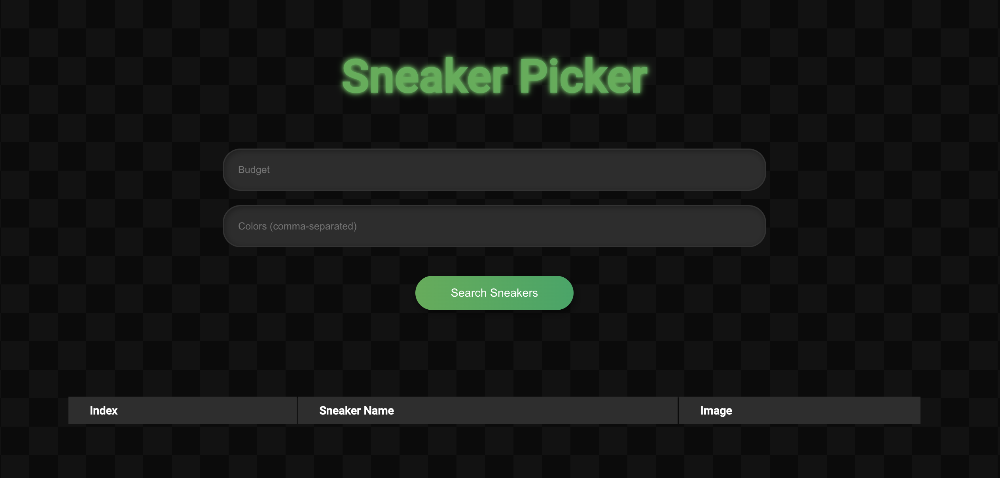
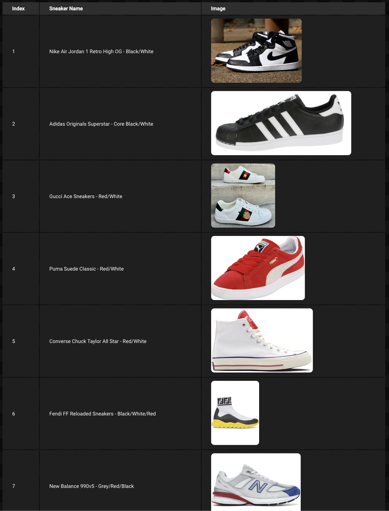

# Sneaker Picker Application

## Description
Sneaker Picker is a web application that helps users to find sneaker recommendations based on their budget and preferred colors. The application utilizes a React-based front-end, an Express backend server, and leverages OpenAI GPT to generate the sneaker suggestions. The app also fetches images for the suggested sneakers using the Bing Image Search API.

 
 

## Features
1. User-friendly interface to enter budget and preferred colors.
2. Generates a list of 15 sneaker recommendations that include high fashion shoes as well as simpler models.
3. Displays the names of the sneakers and images fetched from the Bing Image Search API.
4. The application has an attractive design with modern styles and animations.

## Technologies Used
- **React**: Used for building the user interface.
- **Express**: Used to create the backend server.
- **Node.js**: The JavaScript runtime used for server-side scripting.
- **OpenAI GPT**: An AI model used for generating sneaker recommendations.
- **Bing Image Search API**: Used to fetch images of the recommended sneakers.
- **CSS**: Used for styling the front-end.
- **Axios**: A promise-based HTTP client for JavaScript used for making HTTP requests.

## How to Run
1. Clone this repository to your local machine.
2. Navigate to the directory of the cloned repository via the command line.
3. Run `npm install` to install all the required dependencies.
4. Create a `.env` file in the root directory.
5. You need to obtain your own API keys for OpenAI and Azure Bing API. Place them in the `.env` file as environment variables (e.g. `OPENAI_API_KEY=your_api_key`, `BING_API_KEY=your_api_key`).
6. Start the backend server by running `node server.js` in the server directory.
7. Start the React application by running `npm start` in the root directory.
8. Visit `http://localhost:3000` in your web browser to access the application.
9. Input your budget and preferred sneaker colors and click the submit button to get the sneaker recommendations.

## Contributing
Contributions, issues, and feature requests are welcome. Feel free to check issues page if you want to contribute.

## Author
Nikita Tsyganov

For any additional information, feel free to contact me at tsyganov.nikita@gmail.com
